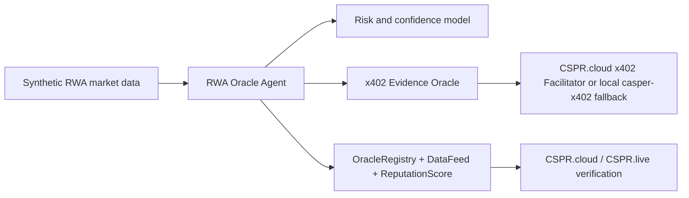

# Casper RWA Oracle Agent

Agentic RWA oracle prototype for the Casper Agentic Buildathon 2026.

The project will build an autonomous oracle agent that gathers synthetic off-chain RWA signals, requests paid premium evidence through x402, runs AI-style risk and confidence scoring, and publishes verified data plus oracle reputation updates to Casper Testnet through Odra smart contracts.

## Buildathon Target

- Track: Casper Innovation Track
- Focus: Agentic AI + Real-World Assets (RWA)
- Required final artifacts:
  - Working Casper Testnet prototype with a transaction-generating on-chain component
  - Open-source GitHub/GitLab/Bitbucket repository with README and usage docs
  - Public demo video explaining the project and walkthrough

## Current Phase

Phase 2 has passed Manus review. The Odra contract crate includes `RwaOracle`, covering oracle registration, data publication, evidence hashes, latest/history reads, reputation updates, owner-controlled slashing, and owner-controlled oracle pause. A livenet deployment runner is prepared for Casper Testnet and is waiting on local Testnet key material. Phase 3 begins the TypeScript agent core in mock mode while live deployment materials are pending.

## Planned Architecture



## Repository Layout

- `contracts/`: Odra smart contract workspace planned for oracle registry, data feed, and reputation modules
  - `contracts/rwa-oracle/`: Phase 1 Odra contract crate and unit tests
- `agent-backend/`: TypeScript oracle agent planned for RWA data evaluation and transaction submission
- `oracle-server/`: x402 evidence oracle planned for paid RWA risk and market evidence
- `docs/`: official rules, implementation guide, resources, and demo planning
- `checkpoints/`: Codex checkpoint reports for Manus review
- `manus_outbox/`: exact messages prepared for Manus submission
- `manus_feedback/`: saved Manus feedback and feedback log
- `skills/casper-buildathon-rwa-loop/`: project-specific Codex skill/guide

## Secret Handling

Do not commit private keys, API keys, CSPR.cloud tokens, `.env` files, or raw private asset documents. Final implementation will use environment variables and local key paths only.

## Phase 1 Contract Verification

The Odra crate uses nightly Rust because `odra-macros 2.7.2` currently requires a nightly feature. The contract crate includes `contracts/rwa-oracle/rust-toolchain.toml`.

Run:

```bash
cd contracts/rwa-oracle
cargo odra test
```

Latest local result: 7 tests passed for duplicate registration rejection, registered publish success with evidence hash, unregistered publish rejection, reputation/slash behavior, newest-first history reads, paused-oracle publish rejection, and owner-only pause enforcement.

## Phase 2 Testnet Deployment

See `docs/phase-2-deployment.md`.

```bash
cd contracts/rwa-oracle
cargo odra build -c RwaOracle
cargo run --bin deploy --features livenet
```

The deploy runner reads local Odra livenet variables from `.env`, deploys `RwaOracle`, registers the signing account as the demo oracle, publishes one sample RWA datapoint, and prints the contract package hash plus sample output. Real `.env` and key files must stay local and uncommitted.
