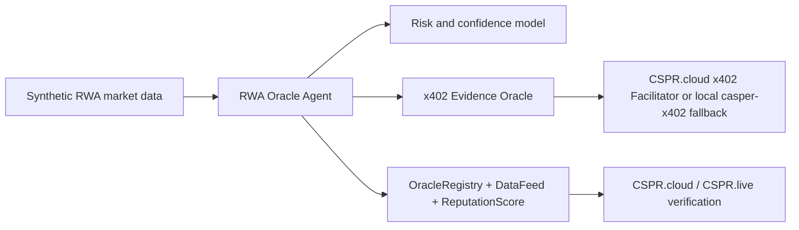

# Casper RWA Oracle Agent

Agentic RWA oracle prototype for the Casper Agentic Buildathon 2026.

The project will build an autonomous oracle agent that gathers synthetic off-chain RWA signals, requests paid premium evidence through x402, runs AI-style risk and confidence scoring, and publishes verified data plus oracle reputation updates to Casper Testnet through Odra smart contracts.

## Buildathon Target

- Track: Casper Innovation Track
- Focus: Agentic AI + Real-World Assets (RWA)
- Required final artifacts:
  - Working Casper Testnet prototype with a transaction-generating on-chain component
  - Open-source GitHub/GitLab/Bitbucket repository with README and usage docs
  - Public demo video explaining the project and walkthrough

## Current Phase

Phase 0 passed Manus review. Manus requested a pivot from pure KYC/compliance to **RWA Oracle Agent with Verifiable On-Chain Identity**. Phase 1 now targets local Odra contract modules and tests.

## Planned Architecture

## Repository Layout

- `contracts/`: Odra smart contract workspace planned for oracle registry, data feed, and reputation modules
- `agent-backend/`: TypeScript oracle agent planned for RWA data evaluation and transaction submission
- `oracle-server/`: x402 evidence oracle planned for paid RWA risk and market evidence
- `docs/`: official rules, implementation guide, resources, and demo planning
- `checkpoints/`: Codex checkpoint reports for Manus review
- `manus_outbox/`: exact messages prepared for Manus submission
- `manus_feedback/`: saved Manus feedback and feedback log
- `skills/casper-buildathon-rwa-loop/`: project-specific Codex skill/guide

## Secret Handling

Do not commit private keys, API keys, CSPR.cloud tokens, `.env` files, or raw private asset documents. Final implementation will use environment variables and local key paths only.
