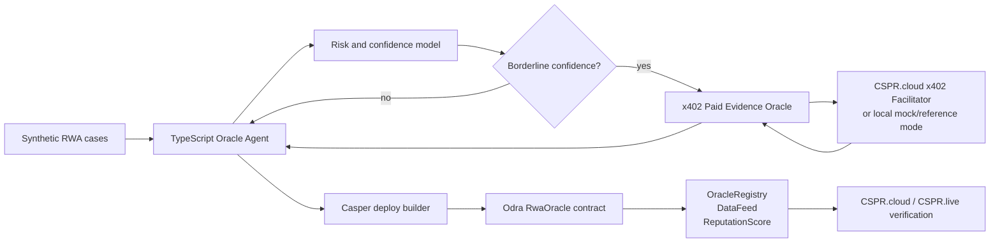

# Casper RWA Oracle Agent

Autonomous real-world asset oracle agent for the Casper Agentic Buildathon 2026.

## Overview

Casper RWA Oracle Agent turns off-chain real-world asset signals into auditable Casper Testnet data. The agent loads RWA cases, scores risk and confidence, buys premium evidence through an x402-style paid oracle when a case is uncertain, hashes evidence provenance, and prepares Casper `publish_data` transactions against an Odra smart contract that tracks oracle identity, data feeds, and reputation.

The project is designed for the Casper Innovation Track, focused on Agentic AI plus RWA. Raw private documents are never written on-chain; only values, confidence scores, evidence hashes, timestamps, and reputation state are stored or prepared for contract calls.

## Architecture



## Key Features

- Autonomous RWA data collection and AI-style risk assessment.
- x402 paid evidence flow with `402 Payment Required`, signed retry, and premium data response.
- Borderline-case upgrade logic: the agent pays only when extra evidence can change the decision.
- Odra `RwaOracle` contract with self-registered oracle identity, data feed history, evidence hashes, reputation updates, slashing, and owner-only pause.
- Mock-first terminal demo plus live Testnet deployment path that keeps private keys and API tokens local.
- Manus review loop evidence saved in `checkpoints/`, `manus_outbox/`, and `manus_feedback/`.

## Casper AI Toolkit Usage

- **Odra**: smart contract implementation, tests, wasm build, and livenet deploy/register/publish runner.
- **Casper Testnet / CSPR.cloud endpoints**: documented node, events, REST, and MCP endpoints for deployment and verification.
- **x402**: paid premium RWA evidence flow using the CSPR.cloud facilitator shape, with local mock/reference mode while facilitator credentials are pending.
- **CSPR.trade MCP**: optional enrichment path for future DeFi context. `npm run mcp:check` exposes a graceful smoke-test entry point that calls `get_tokens` when an MCP bridge is configured and exits cleanly when the local tool is unavailable.

## Quick Start

Requirements:

- Node.js 22 or newer
- Rust nightly with `wasm32-unknown-unknown`
- `cargo-odra`
- Binaryen and WABT for wasm optimization/stripping when building the contract for livenet

Run the Odra contract tests:

```bash
cd contracts/rwa-oracle
cargo odra test
```

Run the TypeScript agent in mock mode:

```bash
cd agent-backend
npm install
npm test
npm run build
npm run agent:mock
npm run mcp:check
```

Run the x402 oracle server tests:

```bash
cd oracle-server
npm test
```

Exercise the local HTTP 402 flow:

```bash
cd oracle-server
npm start
```

In another shell:

```bash
cd agent-backend
X402_ORACLE_BASE_URL=http://127.0.0.1:3002 npm run agent:mock
```

Run the full local qualification gate:

```bash
make verify
```

Capture local HTTP x402 evidence for demo recording:

```bash
make demo-evidence
```

After public repo/video/Testnet artifacts exist, fill the final submission links:

```bash
node scripts/fill-submission-artifacts.mjs \
  --repo-url https://github.com/YOUR_ACCOUNT/casper-rwa-oracle-agent \
  --demo-url https://YOUR_PUBLIC_VIDEO_URL \
  --contract-package-hash hash-YOUR_CONTRACT_PACKAGE_HASH \
  --deploy-hash YOUR_SAMPLE_DEPLOY_HASH
```

Expected terminal story:

1. The agent loads synthetic RWA cases.
2. A borderline warehouse lease case triggers premium evidence lookup.
3. The oracle server returns `402 Payment Required`.
4. The agent builds a mock/reference Casper x402 payment payload.
5. The agent retries with `PAYMENT-SIGNATURE`.
6. The oracle returns premium risk evidence and `PAYMENT-RESPONSE`.
7. The agent upgrades the case to publish and prints Casper `publish_data` deploy JSON.

## Smart Contract (Testnet)

- Contract: `contracts/rwa-oracle`
- Module: `RwaOracle`
- Network: `casper-test`
- Contract package hash: pending live Testnet deployment
- Explorer base: [CSPR.live Testnet](https://testnet.cspr.live/)

The livenet deployment path is implemented in `contracts/rwa-oracle/src/bin/deploy.rs` and documented in `docs/phase-2-deployment.md`.

```bash
cd contracts/rwa-oracle
cargo odra build -c RwaOracle
cargo run --bin deploy --features livenet
```

Live deployment requires local-only materials:

- `contracts/rwa-oracle/.env`, copied from `.env.example`
- a Casper Testnet secret key in `contracts/rwa-oracle/keys/`
- enough faucet CSPR for deploy gas

No `.env`, PEM, key, token, or raw private asset document should be committed or sent to Manus.

## Demo Video

Demo script: `docs/demo-video-script.md`

Public video URL: pending recording and upload before DoraHacks submission.

DoraHacks submission draft: `docs/dorahacks-submission-draft.md`

Recommended qualification demo path:

1. Show this README and architecture diagram.
2. Run `npm run agent:mock`.
3. Show the x402 logs: `PAYMENT_REQUIRED -> PAYMENT_SIGNED -> DATA_RECEIVED`.
4. Show the upgraded publish decision and Casper deploy JSON.
5. If Testnet keys are available, show the deployed contract package and transaction hash in CSPR.live.

## Project Structure

```text
.
├── agent-backend/          TypeScript RWA oracle agent
├── contracts/rwa-oracle/   Odra smart contract and livenet deploy runner
├── oracle-server/          Local x402 paid evidence oracle
├── docs/                   Rules, resources, phase docs, demo script
├── checkpoints/            Phase reports for Manus review
├── manus_outbox/           Messages submitted to Manus
├── manus_feedback/         Saved Manus responses
├── scripts/                Verification scripts
└── skills/                 Project-specific Codex skill
```

## Current Verification

Latest local gates:

- `cd contracts/rwa-oracle && cargo odra test`: 7 tests passed
- `cd contracts/rwa-oracle && cargo odra build -c RwaOracle`: passed with macOS `DYLD_LIBRARY_PATH="$(rustc --print sysroot)/lib"` workaround when needed
- `cd contracts/rwa-oracle && cargo check --features livenet --bin deploy`: passed
- `cd agent-backend && npm test`: 10 tests passed
- `cd agent-backend && npm run build`: passed
- `cd agent-backend && npm run mcp:check`: passed with graceful CSPR.trade MCP unavailable notice
- `cd oracle-server && npm test`: 3 tests passed
- `make demo-evidence`: local HTTP x402 evidence capture passed
- `make verify`: full local qualification gate passed
- `make fill-artifacts-dry-run`: final artifact fill script dry run passed
- `./scripts/verify-phase0.sh`: structure and secret scan passed

Live external blockers:

- user-provided funded Casper Testnet key
- deployed contract package hash
- CSPR.cloud x402 facilitator authorization token
- real Casper EIP-712 payment signing material

## Submission Readiness

See `docs/submission-readiness.md`.

Must-have artifacts for DoraHacks:

- ✅ Open-source-ready repository contents
- ✅ README with usage instructions
- ✅ Working local prototype and tests
- ✅ Transaction-generating Casper Testnet deploy path
- ⏳ Live Testnet contract hash after key material is provided
- ⏳ Public GitHub/GitLab/Bitbucket remote URL
- ⏳ Public demo video URL

## Comparison With Existing Solutions

Most RWA compliance and oracle workflows are manually reviewed, centralized, or opaque about evidence provenance. This prototype combines autonomous case triage, paid evidence retrieval, and Casper on-chain provenance so reviewers can inspect why an RWA signal was published, which evidence hash supported it, and which oracle identity is accountable. The current mock-first flow keeps the qualification demo reliable while preserving a direct path to live CSPR.cloud x402 settlement and Testnet verification.

## Future Roadmap

- Q3 2026: complete live Casper Testnet deployment, publish transaction hashes, and wire real CSPR.cloud x402 facilitator settlement.
- Q3 2026: add CSPR.trade MCP enrichment for on-chain DeFi context around RWA risk decisions.
- Q4 2026: launch a multi-oracle reputation network with owner/governance controls.
- Q4 2026: add verifiable credential and compliance attestations without storing raw KYC files on-chain.
- Mainnet path: harden contract upgrades, expand paid data providers, and publish social/community channels for long-term launch support.

## Team

Solo builder project prepared for the Casper Agentic Buildathon 2026 qualification round. Public profile, social, repository, and demo links should be attached on the DoraHacks submission page before final submission.

## License

MIT. See `LICENSE`.
