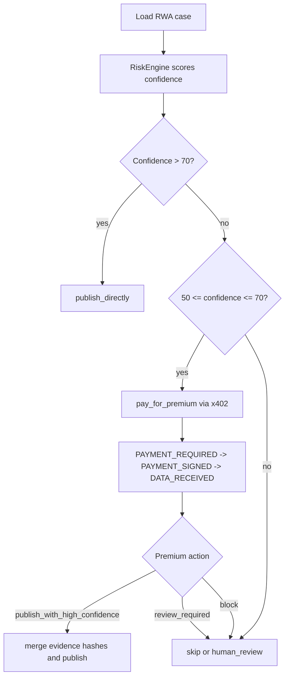
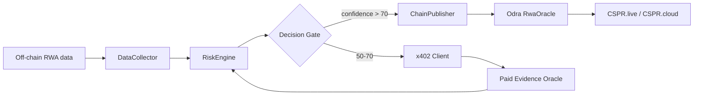
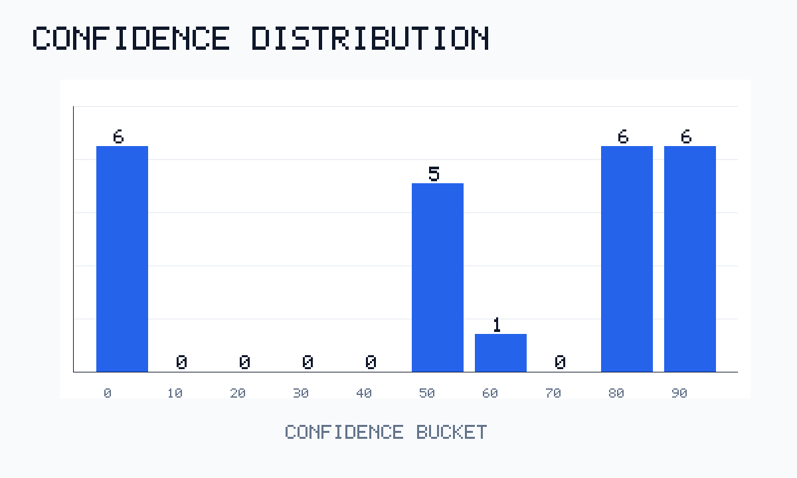
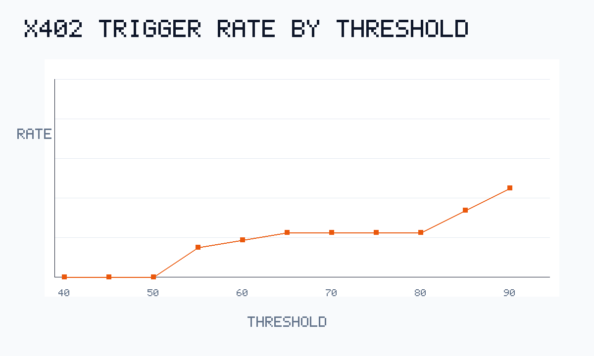
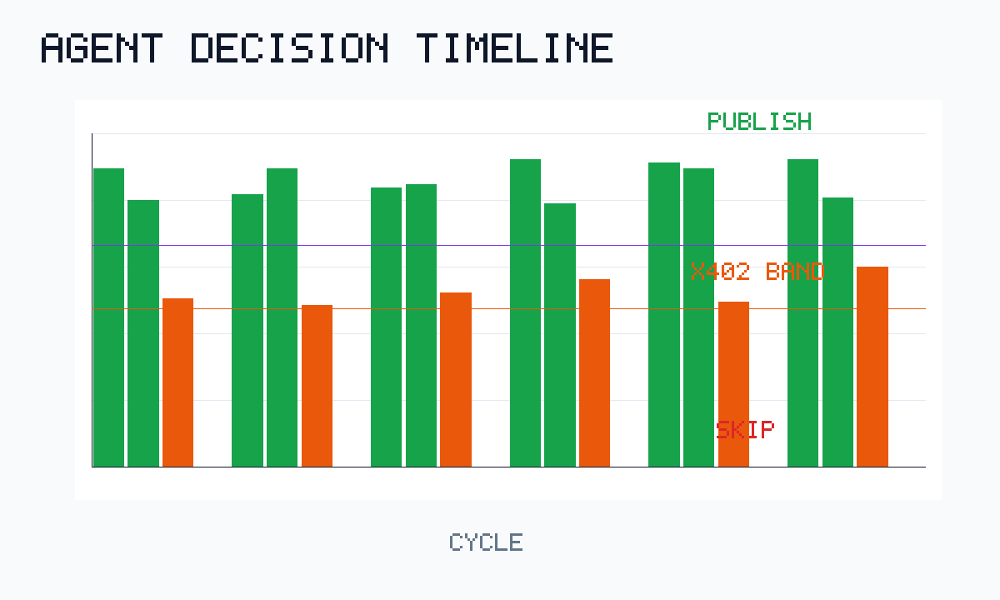

# Casper RWA Oracle Agent

[](https://github.com/wangyichang-studo/casper-rwa-oracle-agent/actions/workflows/ci.yml)


> Autonomous RWA oracle agent that buys premium evidence with x402 only when confidence is borderline, then publishes privacy-preserving evidence hashes to Casper Testnet.

## The Problem

RWA data is useful on-chain only when users can trust where it came from, why it was accepted, and which oracle is accountable. A simple scheduled script can fetch a value and publish it, but it cannot explain whether the data was strong enough, whether extra evidence was worth buying, or how the decision maps to an auditable on-chain record.

This project targets that gap for the Casper Agentic Buildathon: an agentic RWA oracle loop that evaluates confidence, spends only when uncertainty justifies it, and writes a verifiable result to Casper Testnet without exposing raw private asset documents.

## Our Solution

Casper RWA Oracle Agent runs a deterministic local demo path and a live Casper Testnet proof path:

- Collect synthetic RWA cases across invoices, leases, treasury rates, and commodity custody signals.
- Score each case with a risk/confidence model. The code uses 0-100 confidence, equivalent to a 0.00-1.00 score for judging narratives.
- Route decisions through an explicit `DecisionMaker`: confidence above 70 publishes directly; confidence 50-70 triggers x402 premium evidence; lower confidence is skipped or left for review.
- Hash base evidence and premium evidence provenance with SHA-256.
- Prepare or submit Casper `publish_data` calls against an Odra `RwaOracle` contract that stores oracle identity, data feed history, reputation, and `evidence_hash`.

Raw invoices, KYC data, wallet secrets, `.env` files, PEM files, and API keys are never committed and are not sent to Manus.

## How The AI Agent Thinks



Decision pseudocode:

```ts
if (confidence > 70) {
  decision = "publish_directly";
} else if (confidence >= 50 && confidence <= 70 && x402.enabled) {
  decision = "pay_for_premium";
} else {
  decision = riskDecision === "skip" ? "skip" : "human_review";
}
```

JSONL evidence logs are available for machine review:

```bash
cd agent-backend
npm run agent:json
```

Example line:

```json
{"assetId":"rwa-demo-warehouse-lease-009","confidence_score":55,"decision":"pay_for_premium","timestamp":"2026-06-06T00:00:00.000Z","module_name":"DECISION_GATE","action":"EVALUATED"}
```

The local demo also shows the x402 sequence:

```text
PAYMENT_REQUIRED -> PAYMENT_SIGNED -> DATA_RECEIVED
```

## Architecture

The source Mermaid diagram is tracked at `docs/architecture.mmd`.



## Competition Visuals

These charts are generated from deterministic local agent evaluation cycles. They are not claimed as live Testnet transactions.







Regenerate them with:

```bash
make competition-assets
```

## Casper AI Toolkit Usage

| Toolkit Component | How We Use It | Evidence |
| --- | --- | --- |
| Odra Framework | Smart contract implementation, tests, WASM build, and Testnet deploy/register/publish runner. | `contracts/rwa-oracle`, 7 Odra tests |
| Casper Testnet / CSPR.cloud path | Testnet node/API path for deployment and explorer-verifiable transactions. | live contract package and deploy hashes below |
| x402 Protocol | HTTP 402 paid evidence loop for borderline RWA cases; live facilitator path is wired but not falsely claimed without credentials. | `oracle-server`, `agent-backend/src/x402-client.ts`, `make demo-evidence` |
| CSPR.trade MCP | Non-blocking smoke/enrichment path; exits cleanly unless a local MCP bridge is configured. | `cd agent-backend && npm run mcp:check` |
| Casper MCP / ecosystem query path | Documented future path for structured on-chain reads and cross-validation. | `docs/resources.md`, roadmap |

## Live Testnet Evidence

- Network: `casper-test`
- Contract package hash: `hash-8c5d2f16c0a552f95e92ab9a5efcac562dca17abb05db9359bfda270e3659cd8`
- Public repository URL: [https://github.com/wangyichang-studo/casper-rwa-oracle-agent](https://github.com/wangyichang-studo/casper-rwa-oracle-agent)
- Public video URL: [Demo video](https://youtu.be/PKxla50K31s)
- Contract explorer: [CSPR.live contract package](https://testnet.cspr.live/contract-package/hash-8c5d2f16c0a552f95e92ab9a5efcac562dca17abb05db9359bfda270e3659cd8)
- Sample deploy: [CSPR.live deploy](https://testnet.cspr.live/deploy/dd62fd512ad9f95b4a6522316208d9be890614c31df20d1f5d4aa969daae251b)

Real recorded Testnet transactions:

| Step | TX Hash |
| --- | --- |
| Contract deploy | [`0a9a512e55ceef1ca202ba35d0f0940c78d3fbbfed751d44bfabb8b89b3593d0`](https://testnet.cspr.live/transaction/0a9a512e55ceef1ca202ba35d0f0940c78d3fbbfed751d44bfabb8b89b3593d0) |
| Oracle registration | [`d273321dd62a736d33b2367e04e6e27ad49960777adbdbd283b0bf43b10d4490`](https://testnet.cspr.live/transaction/d273321dd62a736d33b2367e04e6e27ad49960777adbdbd283b0bf43b10d4490) |
| Data publish | [`dd62fd512ad9f95b4a6522316208d9be890614c31df20d1f5d4aa969daae251b`](https://testnet.cspr.live/transaction/dd62fd512ad9f95b4a6522316208d9be890614c31df20d1f5d4aa969daae251b) |

See `docs/testnet_evidence.md` for the evidence table and batch-publish readiness notes. The repository does not claim 20+ live transactions until they are actually executed with local key material and copied from real deploy output.

## Quick Start

Requirements:

- Node.js 22 or newer
- Rust nightly with `wasm32-unknown-unknown`
- `cargo-odra`
- Binaryen and WABT for contract WASM builds

Run the portable CI gate:

```bash
make ci
```

Run the full local qualification gate when the Rust/Odra toolchain is available:

```bash
make verify
```

Run the Agent mock loop:

```bash
cd agent-backend
npm ci
npm test
npm run build
npm run agent:mock
npm run agent:json
```

Run the local HTTP x402 proof:

```bash
make demo-evidence
```

Run Odra contract tests:

```bash
cd contracts/rwa-oracle
cargo odra test
```

Build and run the live deploy/register/publish runner only when local Testnet secrets are present:

```bash
cd contracts/rwa-oracle
DYLD_LIBRARY_PATH="$(rustc --print sysroot)/lib" cargo odra build -c RwaOracle
cargo run --bin deploy --features livenet
```

## Test Results

Current expected local results:

- Agent backend: 16 Node tests pass.
- x402 oracle server: 3 Node tests pass.
- Odra contract: 7 Rust/Odra tests pass.
- `make ci`: passes without private credentials.
- `make submission-check`: passes after public repo/video/Testnet links are filled.

Strict final check:

```bash
make submission-check
```

## Project Structure

```text
.
├── agent-backend/          TypeScript RWA oracle agent
├── contracts/rwa-oracle/   Odra smart contract and livenet deploy runner
├── oracle-server/          Local x402 paid evidence oracle
├── docs/                   Rules, diagrams, charts, submission evidence
├── checkpoints/            Checkpoint reports for Manus review
├── manus_outbox/           Manus review packages
├── manus_feedback/         Saved Manus responses
├── scripts/                Verification and asset-generation scripts
└── skills/                 Project-specific Codex skill
```

## Submission Readiness

See `docs/submission-readiness.md` and `docs/dorahacks-final-submission.md`.

Must-have DoraHacks artifacts:

- Open-source repository contents.
- README with setup and usage instructions.
- Working local prototype and tests.
- Casper Testnet contract package and deploy evidence.
- Public demo video.

Remaining optional external input:

- CSPR.cloud x402 facilitator authorization token if the demo is upgraded from mock/reference x402 to live settlement.

## Comparison With Existing Solutions

Many oracle demos publish data on a schedule. This project makes the decision loop the product: the agent decides when confidence is strong enough, when uncertainty is economically worth an x402 evidence purchase, and when data should not be written on-chain. That distinction is the core Agentic AI contribution.

Compared with RWA projects that store too much off-chain detail, this prototype keeps raw documents private and writes only values, confidence scores, timestamps, evidence hashes, and oracle reputation state to Casper.

## Future Roadmap

- Q3 2026: wire real CSPR.cloud x402 facilitator settlement with local payment signing material.
- Q3 2026: expand TypeScript live publishing beyond the current Odra deploy runner path.
- Q3 2026: add CSPR.trade MCP enrichment for market/liquidity context around RWA risk decisions.
- Q4 2026: launch multi-oracle reputation with governance-controlled slashing and pause policies.
- Mainnet path: harden upgrades, onboard paid RWA data providers, and publish a public product/community channel.

## License

MIT. See `LICENSE`.
