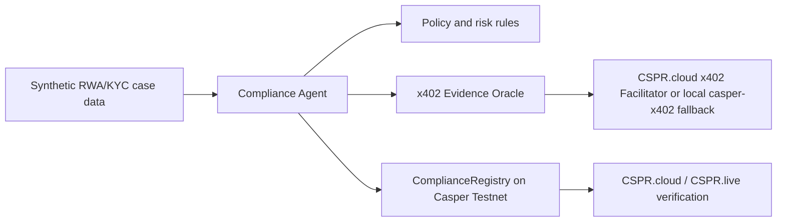

# Casper RWA Compliance Agent

Agentic RWA/KYC compliance prototype for the Casper Agentic Buildathon 2026.

The project will build an AI-assisted compliance agent that evaluates synthetic RWA investor and asset cases, requests paid external risk evidence through x402, and records compliance decisions on Casper Testnet through an Odra smart contract.

## Buildathon Target

- Track: Casper Innovation Track
- Focus: Agentic AI + Real-World Assets (RWA)
- Required final artifacts:
  - Working Casper Testnet prototype with a transaction-generating on-chain component
  - Open-source GitHub/GitLab/Bitbucket repository with README and usage docs
  - Public demo video explaining the project and walkthrough

## Current Phase

Phase 0 is complete locally: official rules, project scope, repo scaffold, and Manus checkpoint package are prepared. Smart contract and agent implementation start only after Manus approves Phase 0.

## Planned Architecture

## Repository Layout

- `contracts/`: Odra smart contract workspace planned for `ComplianceRegistry`
- `agent-backend/`: TypeScript compliance agent planned for case evaluation and transaction submission
- `oracle-server/`: x402 evidence oracle planned for paid risk/KYC evidence
- `docs/`: official rules, implementation guide, resources, and demo planning
- `checkpoints/`: Codex checkpoint reports for Manus review
- `manus_outbox/`: exact messages prepared for Manus submission
- `manus_feedback/`: saved Manus feedback and feedback log
- `skills/casper-buildathon-rwa-loop/`: project-specific Codex skill/guide

## Secret Handling

Do not commit private keys, API keys, CSPR.cloud tokens, `.env` files, or raw KYC documents. Final implementation will use environment variables and local key paths only.

