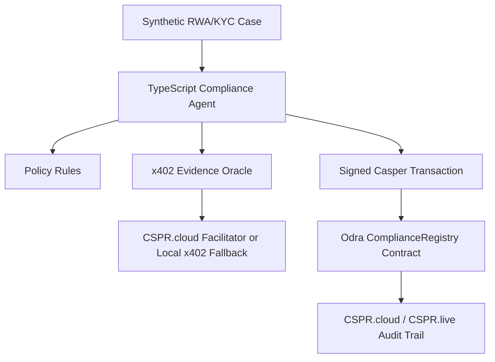

# Codex Closed-Loop Development Guide

This guide replaces the downloaded yield-routing plan with the selected RWA compliance concept.

## Closed-Loop Protocol

Codex must work one phase at a time:

1. Execute only the current phase.
2. Verify outputs locally.
3. Write a checkpoint in `checkpoints/`.
4. Write a matching Manus package in `manus_outbox/`.
5. Submit the package to Manus.
6. Save the exact Manus response in `manus_feedback/`.
7. Continue only after Manus explicitly approves or gives next-step guidance.

## Product Concept

Build a Casper RWA Compliance Agent:

- Synthetic asset and investor cases are loaded locally.
- The agent evaluates RWA/KYC/AML policy rules.
- The agent obtains or verifies external evidence through x402.
- The agent records only privacy-preserving results on-chain:
  - asset or case identifier
  - compliance status
  - risk score
  - evidence hash
  - expiry timestamp
  - audit note hash
- The agent never writes raw KYC documents or personally identifying data to Casper.

## Current Architecture Target

## Phase Plan

### Phase 0: Official Rules and Scaffold

- Record verified DoraHacks rules and resources.
- Create repo scaffold.
- Add project-specific skill/guide.
- Prepare Manus checkpoint and outbox.

### Phase 1: Casper/Odra Contract

- Create `ComplianceRegistry`.
- Implement owner and approved-agent permissions.
- Add case registration, assessment recording, revocation, and read methods.
- Test all permission and status behaviors with Odra.

### Phase 2: Agent and Compliance Workflow

- Create a TypeScript backend.
- Load synthetic RWA cases.
- Evaluate rules and request evidence.
- Produce explainable decisions.
- Submit transaction-generating workflows using local key material only.

### Phase 3: x402 Evidence Service

- Implement paid risk evidence endpoint.
- Return `402 Payment Required` when no payment proof is supplied.
- Verify signed retry through CSPR.cloud facilitator when available.
- Use local casper-x402 fallback when live sponsored access is unavailable.

### Phase 4: Demo, Docs, and Submission

- Final README with setup, contract hash, transaction hashes, and demo walkthrough.
- Public demo video script.
- Security review and secret scan.
- GitHub remote/push after user provides repository URL.

## Mandatory Safety Rules

- Do not commit `.env`, API keys, PEM files, wallet keys, or raw KYC data.
- Do not send private keys to an LLM, remote MCP server, or Manus.
- Treat DoraHacks CAPTCHA and website protections as human-only steps.
- Use CSPR.trade only as optional ecosystem smoke test; this RWA project is not a trading bot.

## Authoritative Resources

- DoraHacks buildathon page: https://dorahacks.io/hackathon/casper-agentic-buildathon/detail
- Casper AI Toolkit: https://www.casper.network/ai
- Casper docs: https://docs.casper.network/
- CSPR.cloud MCP: https://docs.cspr.cloud/agentic-tools/mcp-server
- x402 facilitator: https://docs.cspr.cloud/x402-facilitator-api/reference
- CSPR.trade MCP: https://mcp.cspr.trade/SKILL.md
- Odra LLM docs index: https://odra.dev/llms.txt
- Casper GitHub: https://github.com/casper-network

