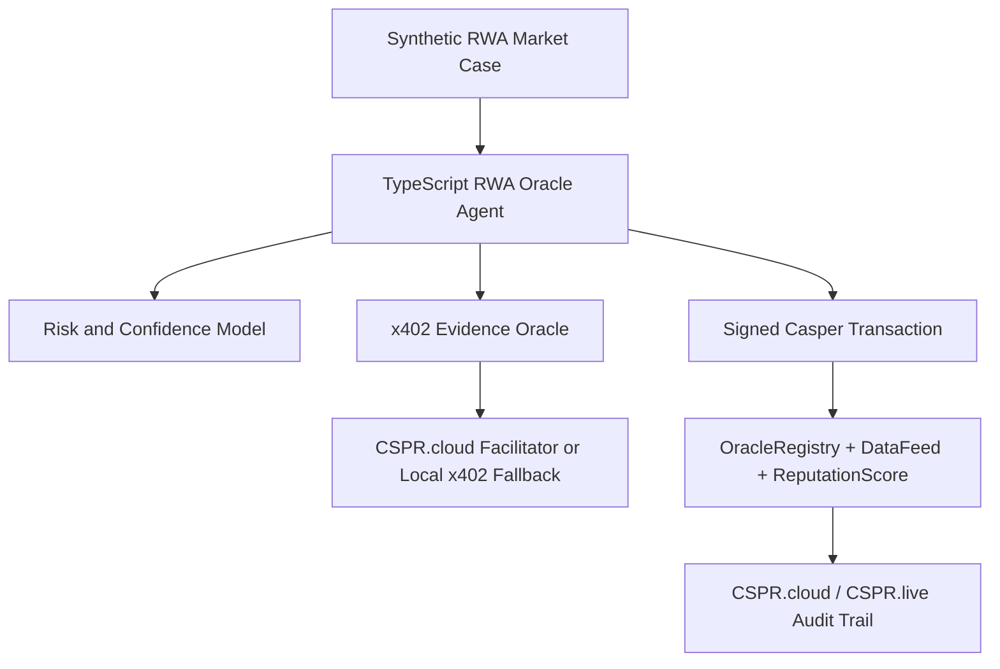

# Codex Closed-Loop Development Guide

This guide replaces the downloaded yield-routing plan with the selected RWA oracle concept, following Manus Checkpoint 00 guidance.

## Closed-Loop Protocol

Codex must work one phase at a time:

1. Execute only the current phase.
2. Verify outputs locally.
3. Write a checkpoint in `checkpoints/`.
4. Write a matching Manus package in `manus_outbox/`.
5. Submit the package to Manus.
6. Save the exact Manus response in `manus_feedback/`.
7. Continue only after Manus explicitly approves or gives next-step guidance.

## Product Concept

Build a Casper RWA Oracle Agent:

- Synthetic RWA market and asset cases are loaded locally.
- The agent gathers or verifies external evidence through x402.
- The agent runs a risk, valuation, and confidence scoring model.
- The agent publishes privacy-preserving oracle outputs on-chain:
  - oracle identity
  - asset identifier
  - estimated value
  - timestamp
  - confidence score
  - evidence hash
  - reputation impact
- The agent never writes raw private asset files, personal documents, or API secrets to Casper.

## Current Architecture Target

## Phase Plan

### Phase 0: Official Rules and Scaffold

- Record verified DoraHacks rules and resources.
- Create repo scaffold.
- Add project-specific skill/guide.
- Prepare Manus checkpoint and outbox.

### Phase 1: Casper/Odra Contract

- Create Odra modules for `OracleRegistry`, `DataFeed`, and `ReputationScore`.
- Implement oracle registration, registered-oracle data publishing, latest/history reads, and reputation/slash operations.
- Test duplicate registration, registered publishing, unregistered publishing rejection, reputation updates, and slash behavior.
- Status: passed Manus Checkpoint 01. Manus requested and Codex implemented `evidence_hash` plus owner-only `pause_oracle` before Phase 2.

### Phase 2: Testnet Deployment and Agent Workflow

- Prepare Odra livenet dependencies, wasm build binary, `.env.example`, and deploy runner.
- Deploy `RwaOracle` to Casper Testnet after local key material is available.
- Register the signing account as the first demo oracle.
- Publish one demo RWA datapoint with evidence hash and record the contract package hash plus deploy/call transaction evidence.
- Status: passed Manus Checkpoint 02 with 7 Odra tests. Live Testnet deploy remains pending local key material, but Manus approved starting Phase 3 in mock mode.

### Phase 3: AI Agent Core

- Create a TypeScript backend.
- Load synthetic RWA market and asset cases.
- Evaluate risk/confidence rules and request evidence.
- Produce explainable decisions.
- Submit oracle data and reputation workflows using local key material only.
- Default to mock mode while Testnet key material is pending; logs must show perception, evidence hashing, decision, and transaction hash/unsigned deploy output.

### Phase 4: x402 Evidence Service

- Implement paid risk evidence endpoint.
- Return `402 Payment Required` when no payment proof is supplied.
- Verify signed retry through CSPR.cloud facilitator when available.
- Use local casper-x402 fallback when live sponsored access is unavailable.

### Phase 5: Demo, Docs, and Submission

- Final README with setup, contract hashes, transaction hashes, and demo walkthrough.
- Public demo video script.
- Security review and secret scan.
- GitHub remote/push after user provides repository URL.

## Mandatory Safety Rules

- Do not commit `.env`, API keys, PEM files, wallet keys, or raw private asset/KYC data.
- Do not send private keys to an LLM, remote MCP server, or Manus.
- Treat DoraHacks CAPTCHA and website protections as human-only steps.
- Use CSPR.trade only as optional ecosystem smoke test; this RWA oracle project is not a trading bot.

## Authoritative Resources

- DoraHacks buildathon page: https://dorahacks.io/hackathon/casper-agentic-buildathon/detail
- Casper AI Toolkit: https://www.casper.network/ai
- Casper docs: https://docs.casper.network/
- CSPR.cloud MCP: https://docs.cspr.cloud/agentic-tools/mcp-server
- x402 facilitator: https://docs.cspr.cloud/x402-facilitator-api/reference
- CSPR.trade MCP: https://mcp.cspr.trade/SKILL.md
- Odra LLM docs index: https://odra.dev/llms.txt
- Casper GitHub: https://github.com/casper-network
